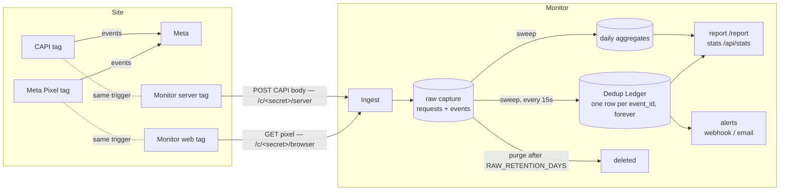
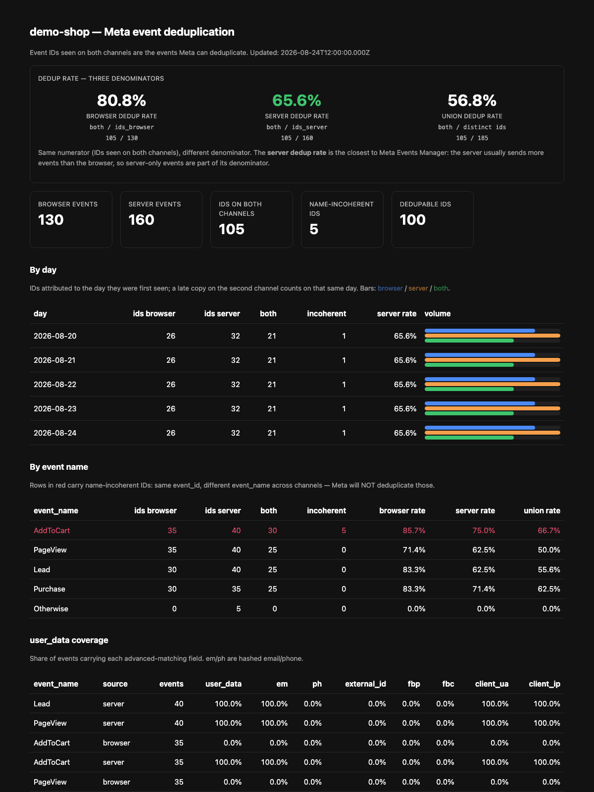

# Meta Dedup Monitor

An always-on, self-hosted monitor for **Meta event deduplication**: it verifies, with your own data, whether the events your site sends from the browser (Pixel) and from the server (Conversions API) actually carry matching `event_id`s — the condition Meta requires to deduplicate them.

## The problem

When you run Meta tracking on both channels, every conversion is sent twice: once by the browser Pixel and once by the Conversions API. Meta deduplicates the two copies **only** when they share the same `event_id` **and** the same event name. When they don't, your campaigns are optimized and billed on inflated numbers, and nothing in Events Manager tells you exactly which events, on which days, for what reason.

## How it works

The Monitor is a **passive collector** built on the mirror method. Two GTM template forks (included in [`gtm-templates/`](gtm-templates/), forked from Stape's Facebook templates) fire on the **same triggers** as your real Meta tags and reuse the **same Event ID variable** — so each copy carries, by construction, the `event_id` Meta received:



1. **Ingest** — every request is stored raw (headers minus secrets, body, query, IP, UA) and, in the same transaction, split into one row per Meta event it carries. Ingest always answers fast with 200; if the DB is ever unavailable, payloads are parked in `fallback.ndjson` and nothing is lost. The browser channel answers GETs with a 1×1 GIF (the only transport a web GTM template can use is an image pixel).
2. **Sweep** — an incremental loop consumes new events in batches and maintains the **Dedup Ledger**: one permanent row per Event ID with per-channel counts, first/last sighting, event names and name coherence. It also feeds per-day aggregates, attributed to the day the ID was **first seen** (a late copy on the second channel counts on that same day).
3. **Read** — the dashboard and the JSON API read only the ledger and the aggregates, never the raw tables: reports stay fast at any history size.
4. **Forget** — raw captures are purged automatically after `RAW_RETENTION_DAYS` (default 14). The ledger and the aggregates are tiny (~100 bytes per event) and are kept forever: that is your dedup history.

What the Monitor **never** does: it never forwards anything to Meta, and it never sits in your tracking path — if the Monitor is down, your real tracking is completely unaffected.

## What it tells you

Three dedup rates, overall, per event name, and per day:

| Metric | Formula | Meaning |
|---|---|---|
| Browser dedup rate | ids on both channels / ids seen on browser | how much of the browser traffic is covered |
| **Server dedup rate** | ids on both channels / ids seen on server | **the number closest to Meta Events Manager** — the server usually sends more events, so server-only events are in its denominator |
| Union dedup rate | ids on both channels / all distinct ids | overall coverage |

Plus: **name incoherence** (same `event_id`, different event name — Meta will NOT deduplicate those), `user_data` coverage per event and channel (advanced-matching quality), server-only user agents (who generates events that never appear in a browser), and threshold **alerts** via webhook or email when the server dedup rate drops.



## Installation

### Quickstart (Docker Compose)

```bash
git clone <this-repo> && cd meta-dedup-monitor
ADMIN_TOKEN=change-me docker compose up -d
```

Send a test event to each channel:

```bash
curl -X POST http://localhost:8080/c/browser \
  -H 'Content-Type: application/json' \
  -d '{"event_name":"Purchase","event_id":"test-1"}'
curl -X POST http://localhost:8080/c/server \
  -H 'Content-Type: application/json' \
  -d '{"data":[{"event_name":"Purchase","event_id":"test-1"}]}'
```

Within ~15 seconds the sweep matches them; open the report at `http://localhost:8080/report?token=change-me`.

Everything is configured through environment variables — all 16 of them documented in [`.env.example`](.env.example). The ones you should set in production: `ADMIN_TOKEN` (mandatory — the app refuses to boot without it), `COLLECT_PATH_SECRET` and `INGEST_KEY` (ingest hardening), `ALERT_THRESHOLD` (e.g. `0.8`) with a webhook or Resend credentials.

### Production deployments

- [Fly.io](docs/deploy-fly.md) — one small VM + volume, ~$3–6/month; `auto_stop_machines = false` is critical (a scaled-to-zero collector silently loses events)
- [VPS](docs/deploy-vps.md) — compose + reverse proxy with TLS (the browser channel must be HTTPS)
- [Backups with Litestream](docs/backup-litestream.md) — continuous replication to R2/B2, fits free tiers
- [Privacy & data retention](docs/privacy.md) — what is stored and for how long

### Wire the tags

Import the two templates from [`gtm-templates/`](gtm-templates/) into your web and server GTM containers and point them at your instance — full walkthrough in the [GTM setup guide](docs/gtm-setup.md), verification steps in the [QA checklist](gtm-templates/QA-CHECKLIST.md). The one rule that makes everything work: **the mirror tags must fire on the same trigger and reuse the same Event ID variable as your real Meta tags.**

### Run from source (development)

```bash
npm install
npm start        # tsx, listens on :8080, data in ./data
npm test         # 66 behavioral tests (vitest, real SQLite on temp dirs)
```

## Event structure

### What the tags send

**Browser channel** — the web template sends a GET image pixel with the event in the query string:

```
GET /c/<secret>/browser?event_name=Purchase&event_id=ev-123&event_time=1756200000&fbp=fb.1.171...&fbc=fb.1.171...
```

**Server channel** — the server template POSTs the exact Conversions API body it would have sent to Meta:

```json
POST /c/<secret>/server            (header: X-Collector-Key: <INGEST_KEY>)
{
  "data": [{
    "event_name": "Purchase",
    "event_id": "ev-123",
    "event_time": 1756200000,
    "user_data": {
      "em": "<sha256>", "ph": "<sha256>", "external_id": "u-42",
      "fbp": "fb.1.171...", "fbc": "fb.1.171...",
      "client_user_agent": "Mozilla/5.0 ...", "client_ip_address": "..."
    },
    "custom_data": { "value": 49.9, "currency": "EUR" }
  }]
}
```

### What the Monitor accepts

You are not limited to the bundled templates: any client that can reach the two endpoints works. The extractor recognizes payloads in this order — CAPI batch `{data:[...]}` (one event per element), JSON array, single JSON object, `application/x-www-form-urlencoded` body, query string, and finally a fallback row that preserves the raw body when nothing parses. Fields are found by **recursive deep search** with aliases, so nesting and naming variations don't matter:

| Field | Accepted keys | Notes |
|---|---|---|
| Event name | `event_name`, `eventName`, `ev` | |
| Event ID | `event_id`, `eventID`, `eventId`, `eid` | the unit of matching |
| Browser ID | `fbp`, `_fbp` | cookie value |
| Click ID | `fbc`, `_fbc` | cookie value |
| Event time | `event_time` | unix seconds |
| External ID | `external_id` | usually inside `user_data` |

`user_data` coverage counters track the presence (never the values) of: `em`, `ph`, `external_id`, `fbp`, `fbc`, `client_user_agent`, `client_ip_address`.

### What is stored

| Table | Content | Lifetime |
|---|---|---|
| `requests` | one row per HTTP request: method, path, IP, UA, query, headers (minus `authorization`/`cookie`/`x-collector-key`, always stripped), body | `RAW_RETENTION_DAYS` (default 14) |
| `events` | one row per Meta event extracted from a request: the six fields above + per-event raw JSON | `RAW_RETENTION_DAYS` |
| `ledger` | **the Dedup Ledger** — one row per Event ID: first/last seen, browser/server counts, first name per channel, name coherence, server UA | forever |
| `agg_daily` | per (day, event name, channel): volumes and user_data coverage counters | forever |
| `agg_daily_dedup` | per (day, event name): ids browser / server / both, name-incoherent count | forever |

## HTTP surface

| Endpoint | Auth | Purpose |
|---|---|---|
| `ALL /c/<secret>/browser` | secret path | browser-channel ingest (GET → 1×1 GIF, POST → `{ok:true}`) |
| `ALL /c/<secret>/server` | `X-Collector-Key` | server-channel ingest |
| `GET /` | none | health check |
| `GET /report` | admin | HTML dashboard |
| `GET /api/stats` | admin | full stats JSON |
| `GET /export.csv` | admin | streaming CSV of events |
| `GET /export.ndjson` | admin | streaming NDJSON of raw requests |
| `GET /export.db` | admin | consistent SQLite snapshot (`VACUUM INTO`) |
| `POST /api/alerts/test` | admin | test notification through the configured channels |

Admin auth accepts `?token=`, the `X-Admin-Token` header, or `Authorization: Bearer`.

## Roadmap

- GTM Community Gallery submission for the two templates
- Cold archive of raw captures to object storage (beyond the local retention window)
- Richer alerting: per-event-name thresholds, anomaly detection on volume gaps

## License

The Monitor is released under the [MIT License](LICENSE). The GTM templates in [`gtm-templates/`](gtm-templates/) are forks of [Stape](https://github.com/stape-io) templates and remain under [Apache-2.0](gtm-templates/LICENSE) with attribution in [`gtm-templates/NOTICE`](gtm-templates/NOTICE).
